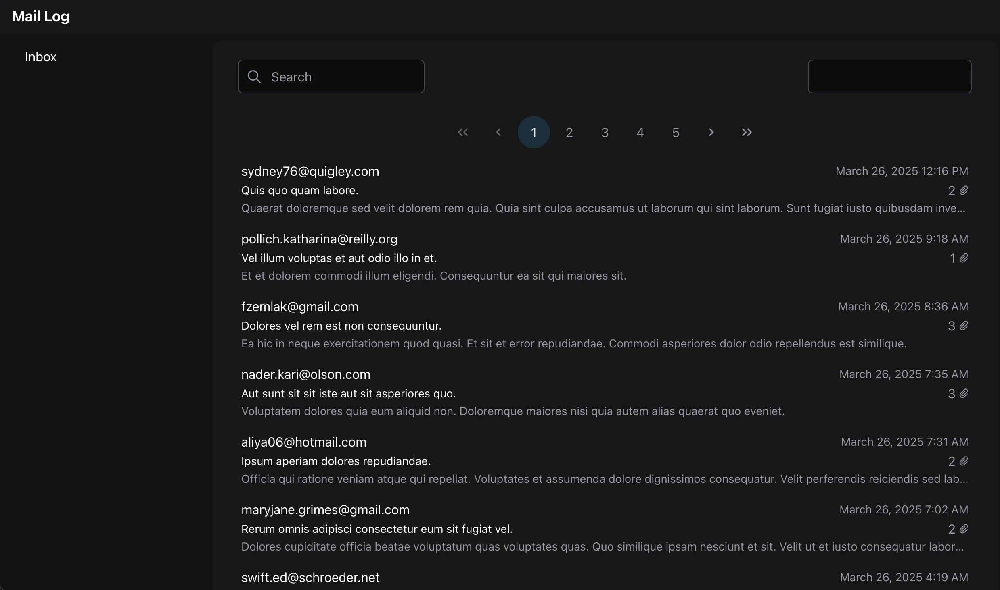
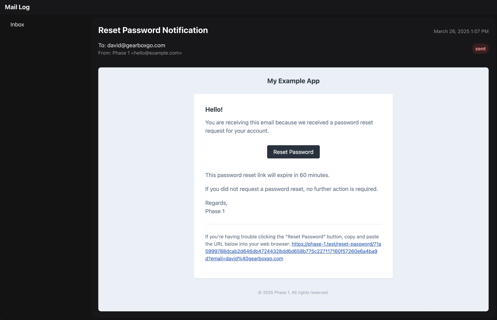

# Mail Log for Laravel

[](https://packagist.org/packages/gearbox-solutions/mail-log)
[](https://packagist.org/packages/gearbox-solutions/mail-log)
[](https://github.com/gearbox-solutions/mail-log/blob/2.x/LICENSE)

This is a package built for [Laravel](https://laravel.com/) to log all emails sent from your application.

Mail Log provides a user interface to view all emails which have been sent. The default location is `https://yourapp.com/mail-log`, but can be changed.

[](./docs/images/mail-log-index.webp)

[](./docs/images/mail-log-detail.webp)

## Installation

Install using composer:

```bash
composer require gearbox-solutions/mail-log
```

Publish and run the migrations to add the mail-logs table:

```bash
php artisan vendor:publish --tag="mail-log-migrations"
php artisan migrate
```

You can publish the config file with:

```bash
php artisan vendor:publish --tag="mail-log-config"
```

## Usage

### Web

Visit the `/mail-log` route to view the emails.

### Commands

Delete all mail logs

```bash
php artisan mail-log:delete-all
```

Delete mail logs older than a certain number of days

```bash
php artisan mail-log:delete-old {days}
```

Skip confirmation prompt by adding the `--yes` flag

```bash
php artisan mail-log:delete-old {days} --yes
```

## Configuration

### Authentication and middleware

All messages are visible at the `/mail-logs` url. By default, this is protected by the `Illuminate\Session\Middleware\AuthenticateSession` middlware. This means that any logged-in user can see all email messages sent. You can change this by changing the `middleware` array in the published `config/mail-log.php` file.

### Database

By default, this package stores all emails sent by your server in the `mail-logs` table of the default database. You can change the database connection used by adjusting the `database` attribute in the published `config/mail-log.php`

## Development

This package is built using the following stack:

- [Inertia.js](https://inertiajs.com/)
- [Vue](https://vuejs.org/)
- [PrimeVue](https://primevue.org/)
- [TailwindCSS](https://tailwindcss.com/)
- [Orchestra Testbench](https://packages.tools/testbench)

Developing this package is done using two local servers. The first is the Testbench Laravel server which is used to serve the app. The second is Vite, which builds the front-end assets.

Run the development Laravel server using

```bash
composer run serve
```

Run the Vite server using

```bash
npm run dev
```

Visit http://localhost:8000/mail-log to view the test emails.

## Building for distribution

Front-end assets are compiled using Vite. The final output is in the `dist` directory. Assets built to this directory are served by laravel through a configuration in the `web.php` routes file.

To compile the assets for distribution, run:

```bash
npm run build
```

Commit these files to version control after running the build command.

Laravel controllers and other php files are delivered as is, and do not need any special processing.

## Testing

Test are handled by Orchestra Testbench. You can run tests with the command:

```bash
composer test
```

## License

The MIT License (MIT). Please see [License File](LICENSE.md) for more information.
